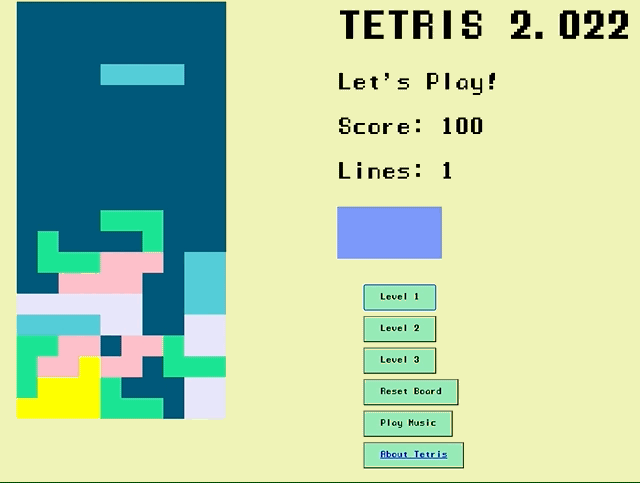

#  Project 1:  **Tetris 2.022**


Hi there, this is my first full coding project completed for the the **General Assembly Software Engineering Immersive Part-Time Course** (Nov 2021 - May 2022). 

**Timeframe**

14 days (35 course hours)

# Goal 

After getting my feet wet with JavaScript, I was asked asked to build a browser-based game of our choice using vanilla JavaScript. 

# Technologies Used 

- HTML5 with HTML5 audio
- CSS3 
- JavaScript(ES6)
- Git
- GitHub
- Google Fonts 
- Sound Website 
- Netlify

#You can play the deployed version here:

[Tetris 2.022](https://elegant-murdock-a314ad.netlify.app/)


## Brief
 **Tetris 2.022** is my version of the classic arcade game created in 1984 by Alexey Pajitnov. If you're a 90's kid, you might of played it on your GameBoy. Tetris requires players to rotate and move falling Tetris pieces,tetriminoes, as their called. Players clear lines by completing horizontal rows of blocks where there are no empty cells. If the pieces reach the top of the board, the game is over. 





 ## How to Play Tetris 2.022
  - Right Arrow = moves a piece right
  - Up Arrow = rotates a piece
  - Left Arrow = moves a piece left
  - Down Arrow & Space Bar = moves a piece down
  - Each row of blocks you fill is 100 points.
  - There are 3 level buttons that increase teh speed at which the tetriminoes fall.
  - Once you've reached 1000 points at each level, the game prompts you try the next level. 

## DEVELOPMENT PROCESS

Since this was the first project that I'd ever coded, I took time to think about what the stages of the coding process would be. I broke the work into phases that seemed to make making the game doable in the 2 weeks we had to work. 

- Phase I: Research 
- I read several  articles and watched a few tutorials about Tetris to get an idea of how I'd like to set up my game. I settled on using a grid where I would map the pieces as arrays. 

- Phase II: Setting up the Grid, Drawing, Rotating and Moving the pieces
- Phase III: Managing collisions and movement a the edge of the board
- Phase IV: Keeping score and ending the game + adding levels
- Phase V: Adding Sound Effects
- Phase VI: Wrapping up loose ends and cleaning up my coade 

## PHASE II: Setting up the Grid, Drawing, Rotating and Moving the pieces


Setting up the grid. 

```
const grid = document.querySelector(".grid")
let squares = Array.from(document.querySelectorAll(".grid div"))

```

The Pieces are set up with a series of arrays mapped onto the array of divs in the grid. the Pieces are continuously redrawn on the board so all orientations of the pieces are housed in one constant/ the version of the piece that appears at the start of its journey down the screen will be rotation index[0].  

Here are is an example of one of the pieces and the lines of code that randomizes which piece drops. 

```

const lPiece = [
  [1, rowLength + 1, rowLength * 2 + 1, 2],
  [rowLength, rowLength + 1, rowLength + 2, rowLength * 2 + 2],
  [1, rowLength + 1, rowLength * 2 + 1, rowLength * 2],
  [rowLength, rowLength * 2, rowLength * 2 + 1, rowLength * 2 + 2]
]

const gamePieces = [lPiece, zPiece, tPiece, oPiece, iPiece]

let currentPosition = 4
let currentRotation = 0

let randomPiece = Math.floor(Math.random() * gamePieces.length)
let currentPiece = gamePieces[randomPiece][currentRotation]


```

Drawing the pieces 
drawPiece() is a function that draws the first iteration of the first piece of the first array and a function that selects a random iteration of the piece. 
```

function drawPiece() {
  currentPiece.forEach(index => {
    squares[currentPosition + index].classList.add("pieces")
    squares[currentPosition + index].style.backgroundColor = color[randomPiece]
  })
}

```
undrawPiece() removes the piece from where it was on the grid by removing the class "pieces"
```
function undrawPiece() {
  currentPiece.forEach(index => {
    squares[currentPosition + index].classList.remove("pieces")
    squares[currentPosition + index].style.backgroundColor = ""
  })
}

```
moveDownScreen() does what it says by moving the piece down the screen. 

```

function moveDownScreen() {
  undrawPiece()
  currentPosition += rowLength
  drawPiece()
  stopMovement()
  console.log(currentPosition, currentPiece)
}

```
### ROTATING AND MOVING THE PIECES

- moveLeft()
- moveRight()
- rotatePiece()

### Phase III: Managing collisions and movement a the edge of the board

stopMovement() is the function that handles collisions in the game. if a piece has a piece that contains the class filled, then all of the pieces are filled. There is a row at the bottom of the grid with a class "bottom" that also operates with this function. My undrawBoard() function clears out the class "filled", so I needed to find a way to prevent pieces from falling off the bottom of the grid. This was one of the challenges I enjoyed solving in the code. 


```


function stopMovement() {
  if (currentPiece.some(index => squares[currentPosition + index + rowLength].classList.contains("filled")) || currentPiece.some(index => squares[currentPosition + index + rowLength].classList.contains("bottom"))) {
    currentPiece.forEach(index => squares[currentPosition + index].classList.add("filled"))
    endGame()
    randomPiece = Math.floor(Math.random() * gamePieces.length)
    currentPiece = gamePieces[randomPiece][currentRotation]
    currentPosition = 4
    drawPiece()
    addScore()
  }
}


```

- isAtRight()
- isAtLeft()
- checkRotatedPiece() 

#### Phase IV: Keeping score and ending the game + adding levels

```
function addScore() {
  for (let i = 0; i < 199; i += rowLength) {
    const row = [i, i + 1, i + 2, i + 3, i + 4, i + 5, i + 6, i + 7, i + 8, i + 9]
    if (row.every(index => squares[index].classList.contains("filled"))) {
      score += 100
      lines += 1
      scoreBoard.innerHTML = score
      lineCount.innerHTML = lines

      row.forEach(index => {
        squares[index].classList.remove("filled")
        squares[index].classList.remove("pieces")
        squares[index].style.backgroundColor = ""
      })
      const squaresRemoved = squares.splice(i, rowLength)
      squares = squaresRemoved.concat(squares)
      squares.forEach(cell => grid.appendChild(cell))
      scoreSnd()
    }
  }
}


```

#### LEVELS:

nextStep() (original play function) is the original play function. To add levels, I simply wrote functions that increased the time interval that timerId was set to. 

```

function nextStep() {
  if (timerId) {
    clearInterval(timerId)
    timerId = null
  } else {
    drawPiece()
    timerId = setInterval(moveDownScreen, 500)
    nextRandom = Math.floor(Math.random() * gamePieces.length)
  }
}

startBtn.addEventListener("click", nextStep)

```
- levelUp2() (time interval increased)
- levelUp3() (time interval increased)

### Phase V: Adding Sound Effects

```
function movePieceSnd(event) {
  const audio = document.createElement("audio")
  audio.src = "audio files /movepiece.mp3"
  audio.play()
}

function rotatePieceSnd(event) {
  const audio = document.createElement("audio")
  audio.src = "audio files /melodic-click.wav"
  audio.play()
}

```

and then called the function within keyControls(e), which moves the pieces and calls the sound function on keyUp. I didn't know about keyCodes, so that was an interesting discovery during this project. 

```


function keyControls(e) {
  if (e.keyCode === 37) {
    moveLeft()
    movePieceSnd()

  }
  else if (e.keyCode === 38) {
    rotatePiece()
    rotatePieceSnd()

  }
  else if (e.keyCode === 39) {
    moveRight()
    movePieceSnd()
  }
}

```

### ENDING PLAY 

```
function endGame() {
  if (currentPiece.some(index => currentPosition + index < rowLength * 3)) {
    clearInterval(timerId)
    gameOverLose()
    winLoseMessage.innerHTML = `Game over. You scored ${score} points and created ${lines} lines. You need ${10 - lines} more lines to complete this level. Wanna try again? Click "Reset Board" then your chosen level button twice. `
  }
  else if (score === 1000) {
    clearInterval(timerId)
    winSnd()
    winLoseMessage.innerHTML = `Amazing! You completed a level. You scored ${score} points and created ${lines} lines. Have a go at the next level! Click "Reset Board" then your chosen level button twice.`
  }
}

```
### THE FUN STUFF

The following are apects of the project that I had fun with: 

- Developing a process for taking on this type of project. As an artist, I think a lot about the creative process and how decisions are made. So for me, just as important as figuring out how to code Tetris was figuring out how to manage my time so that I'd be able to deliver an mvp that looked good. This meant clearly defining my mvp and knowing what features I might need to stop working on so I wasn't working right up until the final deadline. 
- Researching different approaches to coding the game and reading up on the game's origin story.
- Figuring out how to map the tetramino arrays onto my grid.
- Adding styling and sound => I really enjoyed choosing a fun font and sound effects for my game.
- Finding a stopping point and tying up loose ends of the game the day before I needed to present.. 

### CHALLENGES 

 - In some versions of tetris that I looked at, the next piece to drop is shown in a small grid to the side of the playing board. I worked on this feature but decided to let this stretch goal go as the deadline for the project approached.
 - Despite spending several hours working on it and time spent with my instructors, I could not get the button that plays the Tetris theme song to stop once it started. 

### FUTURE VERSIONS

If I'd had more time on this project, here's what I'd have worked on: 

- Changing the background color of the screen when the level is changed.
- Implementing an option for a player to play for a high score that would be saved.
- Implementing a function that lets a piece drop immediately with the space bar. I worked on this as well but had some difficulty with it so decided it didn't need to be part of my mvp.
- Figure out how to stop the Tetris theme song.


